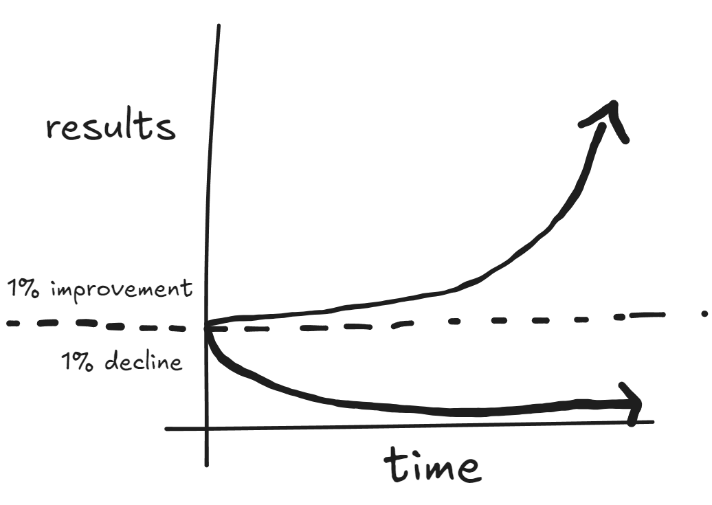

**Habits are the compound interest of self-improvement.** Small habits can make a big difference because they compound over time, leading to significant long-term results. At first, the progress isn't really noticeable but over time, these small improvements compound and results in big.

If you can get 1% better each day for a whole year, you will end up 37 times better by the end of the year. Similarly, if you get 1% worse each day for a year, you will end up even worse then you already were.

We often overlook small changes because they appear insignificant in the moment. 
1. Missing one workout might not affect your fitness goals immediately, but consistently skipping workouts can lead to decreased fitness and weight gain over time.
2. Delaying a small task might not seem critical, but consistently putting off work can lead to mounting deadlines and increased stress.
3. Missing occasional family gatherings or not giving your loved ones enough attention might not seem like a big deal, but it can gradually strain relationships.

In each case, a single small decision might not seem important, but over time, these repeated choices can lead to larger, more significant consequences.

A small change in your daily life can lead you to a whole another destination. Building a habit that is 1% better or 1% worse may seem insignificant in the moment but over time, these habits build your identity. Choose your actions wisely. 