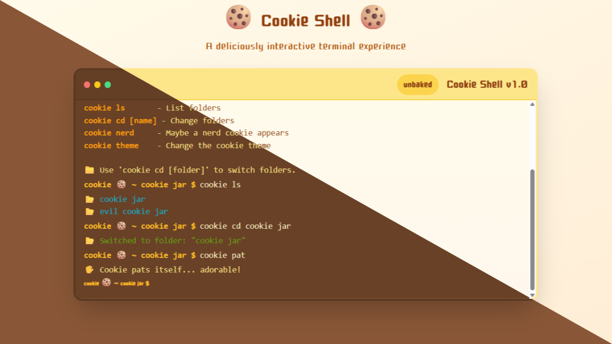

A playful web-based command line interface with a MacOS-inspired design. Cookie Shell combines a sleek UI with fun cookie-themed commands, blending functionality and lighthearted interactions.

## Key Features

🎨 MacOS-style UI with a cute, minimal design <br>
💻 Basic CLI utilities (ls, cd, clear, exit)<br>
🍪 Cookie Jar commands (bake, eat, fortune, fun)<br>
😈 Evil Cookie Jar for playful interactions (bonk, throw, fight, jealous, angry)<br>
🎭 Theme switching to customize the shell’s look

## Tech Stack

- Next.js (framework)
- TypeScript (type safety)
- React (UI components)
- TailwindCSS (styling)

## Installation  

Follow these steps to set up Recoverly locally:  

1. Clone the repository:  
   ```bash
   git clone https://github.com/Irenity0/cookie-shell-app
   ```  

2. Navigate to the project directory:  
   ```bash
   cd cookie-shell-app
   ```  

3. Install dependencies:  
   ```bash
   npm install
   ```  

4. Start the development server:  
   ```bash
   npm run dev
   ```  

---

## Usage  

Once the project is set up, you can:  

1. **Start the Development Server**:  
   Run the following command and access the project at `http://localhost:3000/`:  
   ```bash
   npm run dev
   ```  

2. **Build for Production**:  
   Create a production-ready build using:  
   ```bash
   npm run build
   ```  

3. **Start the Production Server**:  
   After building, run:  
   ```bash
   npm start
   ```  

4. **Deploy**:  
   The easiest way to deploy is with [Vercel](https://vercel.com/):
   ```bash
   vercel
   ```  