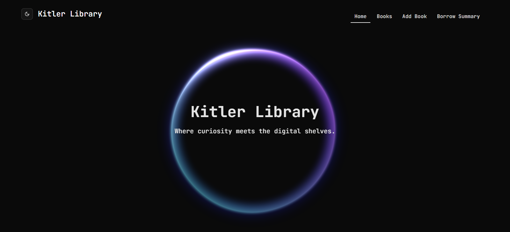

A lightweight library management system built with React, TypeScript, and RTK Query. Manage books and track borrows with quantity and due dates.

**Key Features:**
- Full CRUD for books (add, edit, delete, view)
- Borrow books with quantity + due date
- Borrow summary page
- Responsive, minimal UI

**Tech Stack:** React, TypeScript, Redux Toolkit, RTK Query, Tailwind CSS, Node.js, Express, MongoDB

**Pages:** Books list, Create book, Book details, Edit book, Borrow form, Borrow summary.