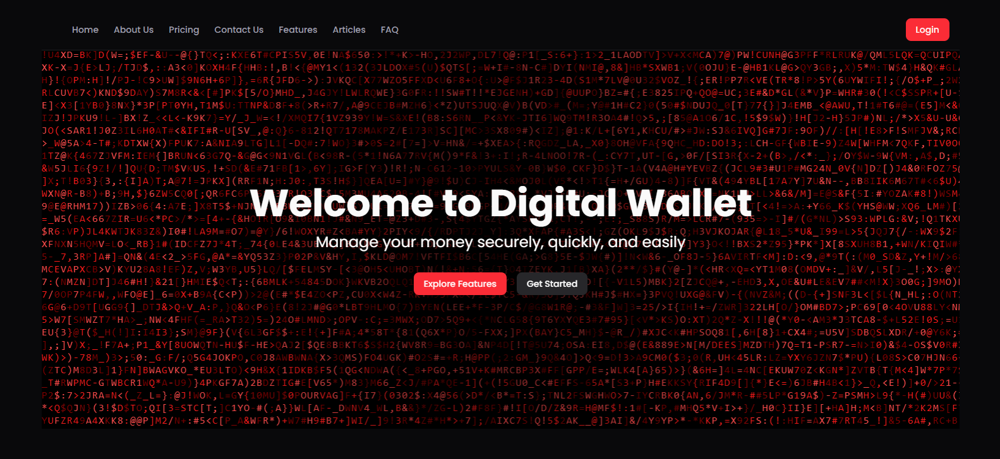

A secure, role-based digital wallet platform built with React, TypeScript, and Redux Toolkit. Provides tailored experiences for Users, Agents, and Admins with specialized dashboards and wallet operations.

**Key Features:**
- Role-specific dashboards for Users, Agents, and Admins
- Secure JWT authentication with encrypted transactions
- Real-time balance updates and transaction history
- Core operations: deposit, withdraw, send money
- Cash-in/cash-out services for Agents
- Complete admin oversight with user and transaction management
- Mobile-first responsive design

**Tech Stack:** React, TypeScript, Redux Toolkit, RTK Query, Tailwind CSS, Node.js, Express, MongoDB

**Pages:** Landing page, About, Features, Contact, FAQ, User Dashboard, Agent Dashboard, Admin Dashboard.